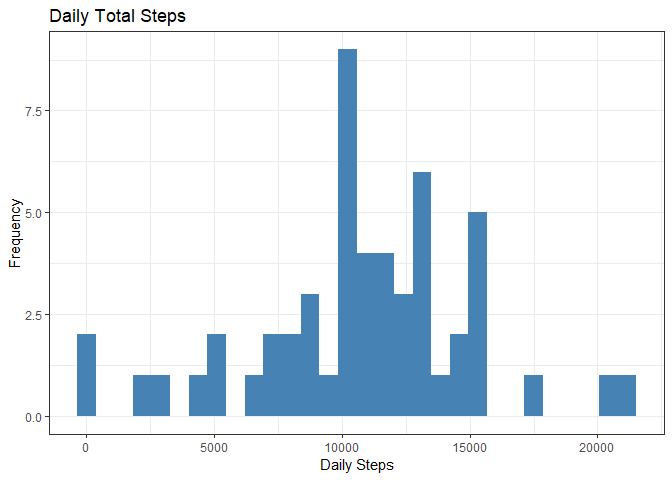
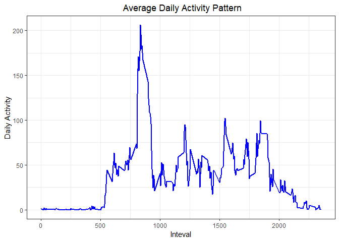
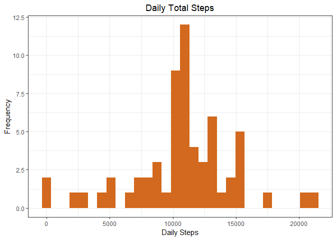
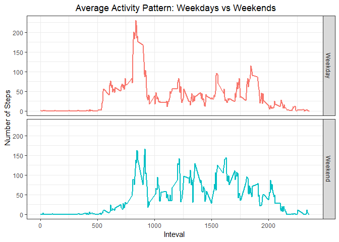

First, I quietely load the packages needed for my analysis and visualizaion.


```r
# loading dplyr and ggplot2 quietely
library(dplyr, quietly = TRUE)
library(ggplot2, quietly = TRUE)
```

## Loading and preprocessing the data

I have already downloaded the data and it's in my working directory C:/Users/Aohagi/Documents/R Programming/Reproducible Research/RepData_PeerAssessment1. Now, I load the data and do some cleaning like changing the date variable to the date format that R recognises. 


```r
# loading data and transforming the date variable from factor to date 
activity <- read.csv('activity.csv')
activity <- transform(activity, date = as.Date(date))
```

## What is mean total number of steps taken per day?

*For this part of the assignment, you can ignore the missing values in the dataset.*

1. Make a histogram of the total number of steps taken each day
2. Calculate and report the mean and median total number of steps taken per day


```r
# first I omitted the missing data and grouped by date and then summarized by total number of steps
daily_steps <- na.omit(activity) %>% group_by(date) %>% summarise(total_daily_steps = sum(steps))

# this is histogram of the total number of steps taken per day
ggplot(daily_steps, aes(x = total_daily_steps)) + geom_histogram(na.rm = TRUE, bins = 30, fill = 'steelblue') +  labs(x = 'Daily Steps', y = 'Frequency') + labs(title = "Daily Total Steps") + theme_bw()
```

<!-- -->


```r
# the mean and median total number of steps taken per day
mn <- with(daily_steps, mean(daily_steps$total_daily_steps))
med <- with(daily_steps, median(daily_steps$total_daily_steps))
```

The mean  and median total number of steps taken per day is 10766.19 and 10765 respectively.

## What is the average daily activity pattern?

1. Make a time series plot of the 5-minute interval (x-axis) and the average number of steps taken, averaged across all days (y-axis)
2. Which 5-minute interval, on average across all the days in the dataset, contains the maximum number of steps?


```r
# omitting the missing values and grouping by interval and then averaging by daily steps
activity_pattern <- na.omit(activity) %>% group_by(interval)%>%summarise(average_daily_pattern = (mean(steps)))

# this is time series plot of the 5-minite interval and the average number of steps 
ggplot(activity_pattern, aes(x = interval, y = average_daily_pattern)) + geom_line(color = 'blue', size = 1) + labs(title = " Average Daily Activity Pattern", x = 'Inteval', y = 'Daily Activity') + theme_bw() + theme(plot.title = element_text(hjust=0.5))
```

<!-- -->


```r
# the 5-minute interval with the maximum number of steps
activity_pattern$interval[which.max(activity_pattern$average_daily_pattern)]
```

```
[1] 835
```

The maximum number of steps by 5-minute interval averaged across all days is 206.17 and in the 835 interval.

## Imputing missing values

Note that there are a number of days/intervals where there are missing values (coded as NA). The presence of missing days may introduce bias into some calculations or summaries of the data.

1. Calculate and report the total number of missing values in the dataset (i.e. the total number of rows with NAs)
2. Devise a strategy for filling in all of the missing values in the dataset. The strategy does not need to be sophisticated. E.g., you could use the mean/median for that day, or the mean for that 5-minute interval, etc.
3. Create a new dataset that is equal to the original dataset but with the missing data filled in.
4. Make a histogram of the total number of steps taken each day and Calculate and report the mean and median total number of steps taken per day. Do these values differ from the estimates from the first part of the assignment? What is the impact of imputing missing data on the estimates of the total daily number of steps?


```r
# total number of missing values in the data
nrow(activity[!complete.cases(activity), ])
```

```
[1] 2304
```

My strategy for filling in all the missing values in the dataset is to use the mean of the 5-minute interval.


```r
# merging the original data and the data grouped by the 5-minute interval
mergedata <- merge(activity, activity_pattern)

# filling the missing values with the average 5-minute interval
mergedata$steps[is.na(mergedata$steps)] <- mergedata$average_daily_pattern[is.na(mergedata$steps)]

# Creating a new dataset that is equal to the original dataset but with the missing data filled in
imputedata <- mutate(mergedata, steps = mergedata$steps) %>% select(c(steps, date,interval))
```


```r
# using the imputed data and grouping the data by date and then summarizing for the total daily steps
dailysteps <- imputedata %>% group_by(date) %>% summarise(total_daily_activity = sum(steps)) 

# histogram of the total number of steps taken per day of the imputed data
ggplot(dailysteps, aes(x = total_daily_activity)) + geom_histogram(na.rm = TRUE, bins = 30, fill = 'chocolate') + labs(x = 'Daily Steps', y = 'Frequency') + labs(title = "Daily Total Steps") + theme_bw() + theme(plot.title = element_text(hjust=0.5))
```

<!-- -->


```r
# mean total number of steps taken per day for the imputed data
mean(dailysteps$total_daily_activity)
```

```
[1] 10766.19
```

```r
# median total number of steps taken per day for the imputed data
median(dailysteps$total_daily_activity)
```

```
[1] 10766.19
```

The mean of the imputed data is similar as before with 10766.19 and median is almost the same with 10766.19. Interestingly, we see here that the mean and median are the same in the imputed data.

## Are there differences in activity patterns between weekdays and weekends?

For this part the weekdays() function may be of some help here. Use the dataset with the filled-in missing values for this part.

1. Create a new factor variable in the dataset with two levels – “weekday” and “weekend” 
indicating whether a given date is a weekday or weekend day.
2. Make a panel plot containing a time series plot (i.e. type = "l") of the 5-minute interval (x-axis)
and the average number of steps taken, averaged across all weekday days or weekend days (y-axis). 


```r
# creating factor variable with two levels – “weekday” and “weekend”
day_type <- if_else(weekdays(imputedata$date) %in% c("Saturday", "Sunday") , 'Weekend', 'Weekday')

# adding the new variable day_type to the dataset
imputedata1 <- mutate(imputedata, day_type = factor(day_type))

# grouping the data by interval and then summarizing for the average daily steps
imputedd <- imputedata1 %>% group_by(interval, day_type) %>% summarise(average_daily_steps = mean(steps))

# making a panel time series plot of the 5-minute interval and the average number of steps taken
ggplot(imputedd, aes(x = interval, y = average_daily_steps, color = factor(day_type))) + geom_line(size = 1,      show.legend=F) + facet_grid(day_type ~ .) + labs(title = " Average Activity Pattern: Weekdays vs Weekends",      x = 'Inteval', y = 'Number of Steps') + theme_bw() + theme(plot.title = element_text(hjust=0.5))
```

<!-- -->

Yes, there is difference in activity pattern between weekdays and weekends. It seems that average steps in weekdays are more than those in the weekends in certain intervals like around 500 to about 1000. However, average steps in weekends appear to be somewhat higher in 1500 to around 1750 interval.
